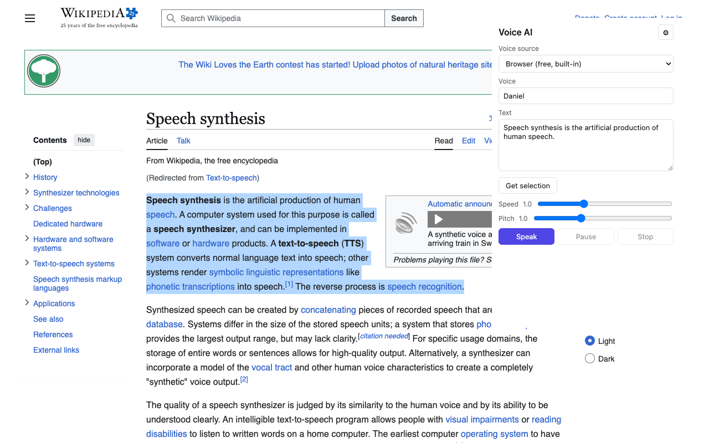

# Voice AI — TTS Extension

A free, open-source text-to-speech extension for Chrome and Firefox. Reads selected text aloud using built-in browser voices, or — for higher quality — your own Groq API key.

No account, no subscription, no tracking. The code shipped to the store is the code in this repo.



## Features

- **Browser voices (default)** — works the moment you install the extension. Free, offline, uses your OS voices.
- **Groq voices (BYOK)** — paste your free Groq API key once and switch to natural PlayAI voices.
- Speak the selected text from any page via popup, context menu, or shortcut.
- Pause, resume, stop. Adjust rate and pitch.
- Settings sync across your browser profile via `chrome.storage.sync`.

## Install

- **Chrome / Edge / Brave** — [Chrome Web Store](https://chromewebstore.google.com/detail/voice-ai-%E2%80%94-tts-extension/hehpkapkahnkcnhdefickibgnoglgfkb)
- **Firefox** — [Firefox Add-ons](https://addons.mozilla.org/firefox/addon/voice-ai-tts-extension/)

## Use your own Groq API key (optional)

1. Sign up at [console.groq.com](https://console.groq.com/) (email only).
2. Create an API key at [console.groq.com/keys](https://console.groq.com/keys).
3. Open the extension settings, paste the key, hit **Save**.
4. In the popup, switch the voice source to **Groq**.

Your key is stored locally in your browser via `chrome.storage.sync` and is sent only to `api.groq.com`.

**Groq free-tier limits** (as of writing): 200 characters per request, 100 requests/day, 50 requests/minute on the `canopylabs/orpheus-v1-english` model. For heavier use, Groq offers a pay-as-you-go Dev Tier at $22 per 1M characters. Current limits: https://console.groq.com/docs/rate-limits

## Development

```bash
npm install
npm run dev       # Vite dev server with HMR
npm run build     # Production build → dist/
npm run typecheck # tsc --noEmit
npm run zip       # Build and zip dist/ for store upload
```

Stack: Vite + TypeScript + [@crxjs/vite-plugin](https://crxjs.dev/).

## Project layout

```
manifest.config.ts   # Manifest V3 declaration
src/
  background.ts      # service worker (context menu)
  popup/             # popup UI
  options/           # options page
  lib/
    web-speech.ts    # Web Speech API wrapper
    groq.ts          # Groq TTS client
    audio.ts         # blob playback
    storage.ts       # settings helpers
icons/               # extension icons
```

## Roadmap

- [ ] Premium tier via voice.smolevich.com (no setup, subscription)
- [ ] Local Kokoro-82M model (opt-in, offline, private). Caveats: ships as a ~80 MB on-demand download, uses ~300–500 MB of RAM during synthesis, and requires WebGPU or a modern CPU for usable speed. Implementation differs between Chrome (offscreen document + `wasm-unsafe-eval`) and Firefox (no offscreen API — runs in the event page), so support and quality may vary by browser.
- [ ] Read full page (article extraction)
- [ ] Highlight text as it's read
- [ ] PDF and Google Docs support
- [ ] More BYOK providers (OpenAI, ElevenLabs, Azure)

## Contributing

Issues and pull requests welcome. If you'd rather build the extension from source than install from the store — for development, review, or to run an unsigned version — load it as an unpacked extension:

### Chrome / Edge / Brave
1. `npm install && npm run build`
2. Open `chrome://extensions`, enable **Developer mode**.
3. Click **Load unpacked** and select the `dist/` folder.

### Firefox (Manifest V3 — Firefox 121+)
1. `npm install && npm run build:firefox`
2. Open `about:debugging#/runtime/this-firefox`.
3. Click **Load Temporary Add-on** and select `dist/manifest.json`.

Run `npm run typecheck` before submitting a pull request.

## License

[MIT](./LICENSE) — see `LICENSE` for details.
